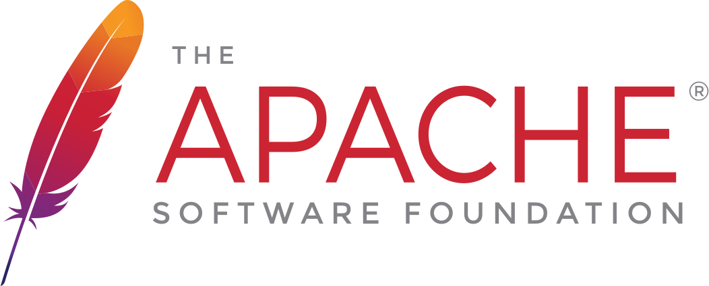

# Apache Xalan-C/C++ XSLT Library

## Overview

The Apache Xalan-C++ Project provides a library and a command line
program to transform XML documents using a stylesheet that conforms to
XSLT 1.0 standards.

Xalan is a project of the Apache Software Foundation.

## Links

* [Project Website](http://xalan.apache.org/xalan-c/)
* Source Repository:
  see [GitHub](https://github.com/apache/xalan-c)
  or [Apache GitBox](https://gitbox.apache.org/repos/asf?p=xalan-c.git)
* [Downloads](http://www.apache.org/dyn/mirrors/mirrors.cgi/xalan/xalan-c)

## Documentation

[Table of Contents](docs/index.md)

